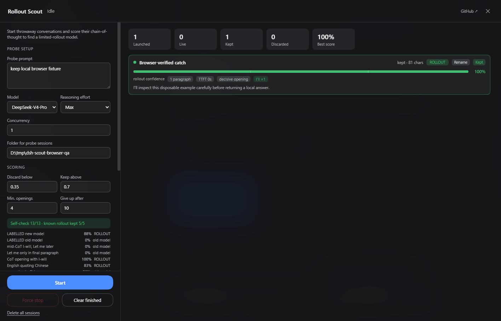
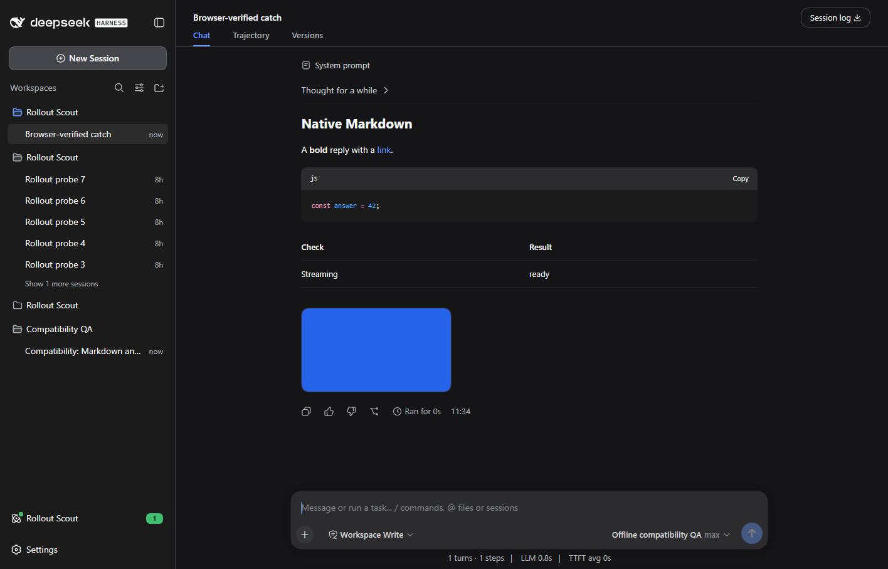

# DSH 0.1.2-rc.1 compatibility

Reviewed on 2026-09-07; npm latest and next both resolve to 0.1.2-rc.1.

Declare the client services and retain the selected reasoning effort when creating an agent. Treat terminal DSH request errors as errors, pause after three consecutive failures, and keep failed probes out of automatic old-model deletion. Previously, model configuration failures could silently create replacement sessions indefinitely.

## Validation

The complete existing suite plus the new terminal-error regression pass. Official DSH 0.1.2-rc.1 Web checks with an offline adapter cover probe creation, max effort, automatic retention, cold rename, restart persistence and the three-failure breaker. Package checks pass.

The real DSH checks used a new disposable home, locally generated attachments and an offline model, with all four plugins installed together. No existing user conversations or remote model credentials were used. The isolated server was stopped after checks.

## Browser acceptance

Passed in an isolated Microsoft Edge test process against the official DSH 0.1.2-rc.1 Web runtime. All four plugins were installed together, with synthetic attachments and a local streaming model.

The console renders a retained local probe and its configured effort. The self-check expands all 13 samples. Clicking the retained card opens the correct real DSH session and renders its response.

No application console errors were recorded. The test browser was closed in the runner cleanup.

