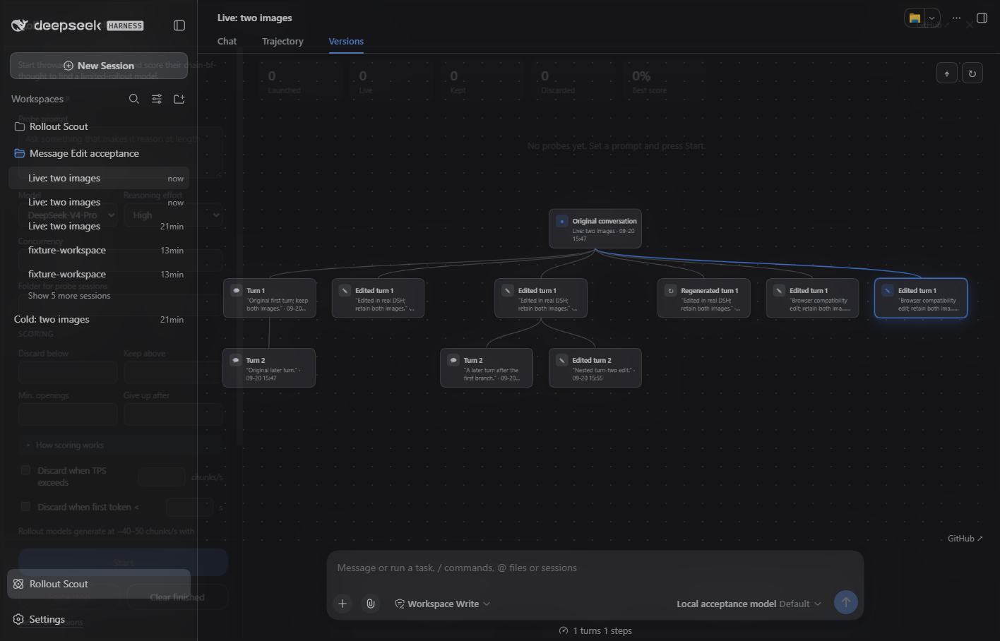

# DSH 0.1.5-rc.2 compatibility

Verified on 2026-09-20 against npm latest/next `0.1.5-rc.2`. The alpha tag is `0.1.6-alpha.2` and is outside this release's declared range.

Consume transient agent/assistant-stream frames on DSH 0.1.5, retain the legacy feed without duplicate counting, and unwrap persistence snapshot headers for cleanup.

## Validation

`npm test` and `npm run check:package` pass.

An offline probe supplies transient reasoning frames, is classified and retained, auto-pauses after one launch, carries max reasoning effort, and supports cold rename. Protected cleanup preserves it; explicit unprotect and cleanup remove it. Three terminal model failures pause the run without automatic deletion. Unit tests cover duplicate-feed suppression and modern persistence snapshots.

All four SpookySandwich plugins were loaded together in a separate DSH home using the official published CLI/Web packages, generated images and a deterministic offline model. No remote model service was exercised. Browser runs own and close their separate headless Edge process; user profiles and conversations are not test targets.

